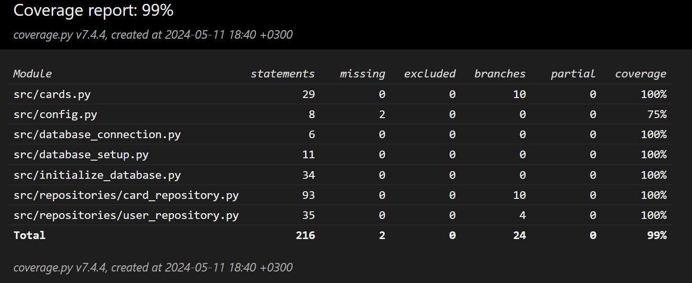

# Testausdokumentti

Ohjelman luokkia ja funktioita on testattu automatisoidusti unittestilla. Unittest luokat sisältävät testitapauksia sekä yksikkö- että integraatiotestaukseen. 

# Testitiedostot

Sovelluksen luokkia testataan tests alihakemistossa card_repository_test.py ja user_repository_test.py tiedostoissa. card_repository_test.py tiedostossa sijaitseva luokka TestCardRepo testaa luokan CardRepository toimintaa ja sen kautta luokan Card toimintaa. user_repository_test.py tiedostossa sijaitseva luokka TestUserRepo testaa luokan UserRepository toimintaa.
Testausta varten sovellus käyttää eri tietokantaa kuin todellisessa käytössä. Testauksessa käytetyn tietokannan nimi määritellään .env.test tiedostossa. 

# Testikattavuus

Ohjelman testikattavuus on käyttöliittymää lukuun ottamatta 99%. Tämä kertoo siitä, että testien haarautumakattavuus on erittäin hyvä ja sovelluksen testit kattavat lähes kaiken sovelluksen koodin.

# Järjestelmätestaus

Sovellusta on testattu manuaalisesti linux ympäristössä. Sovellus toimi oletetusti kun se asennettiin ja käynnistettiin [käyttöohjeen](https://github.com/kirsikkahiltunen/ot-harjoitustyo/blob/master/dokumentaatio/kayttoohje.md) mukaisesti Linux ympäristössä.