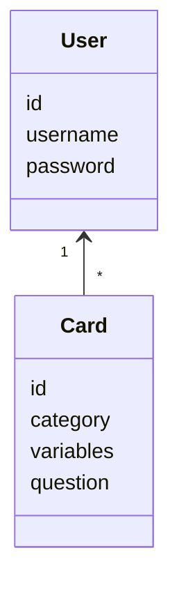
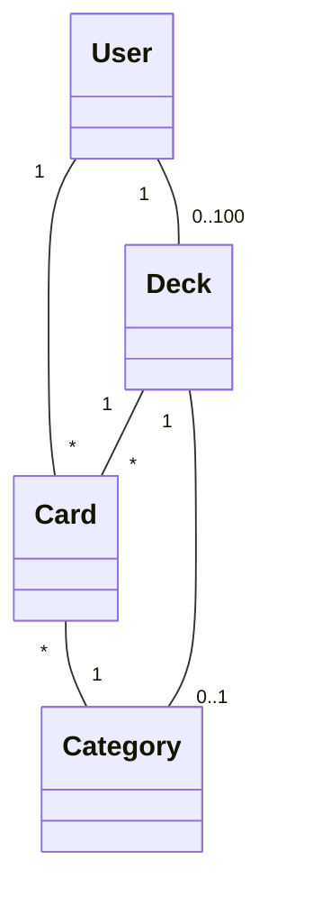
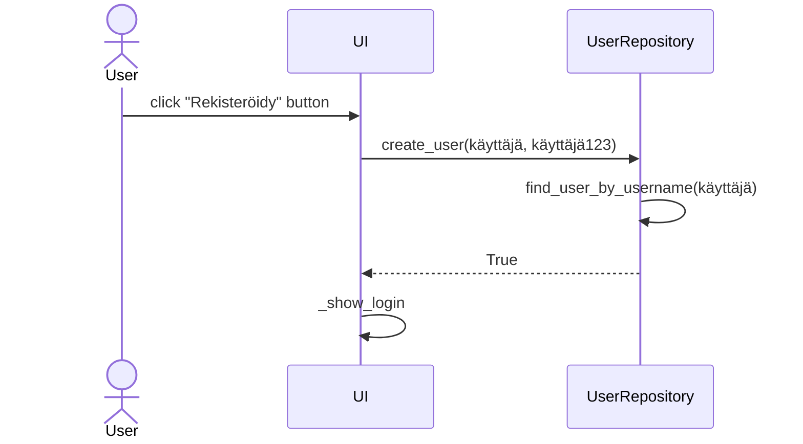
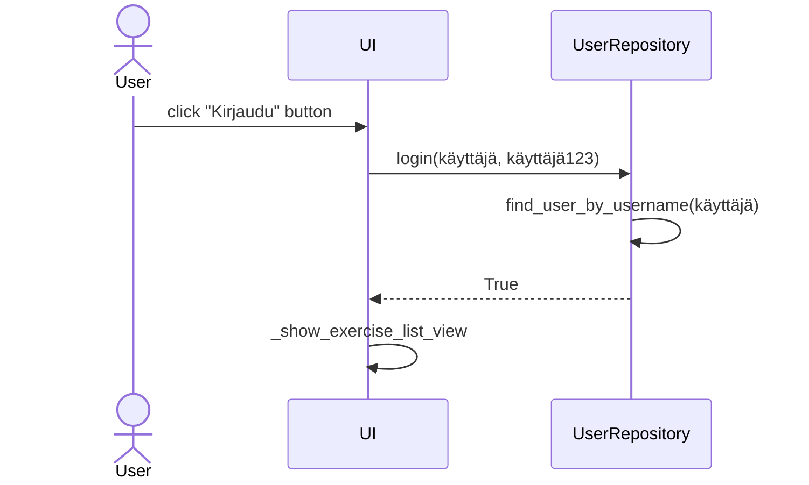
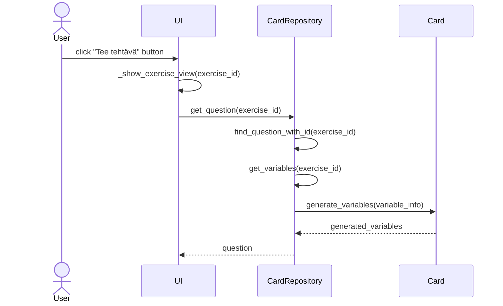
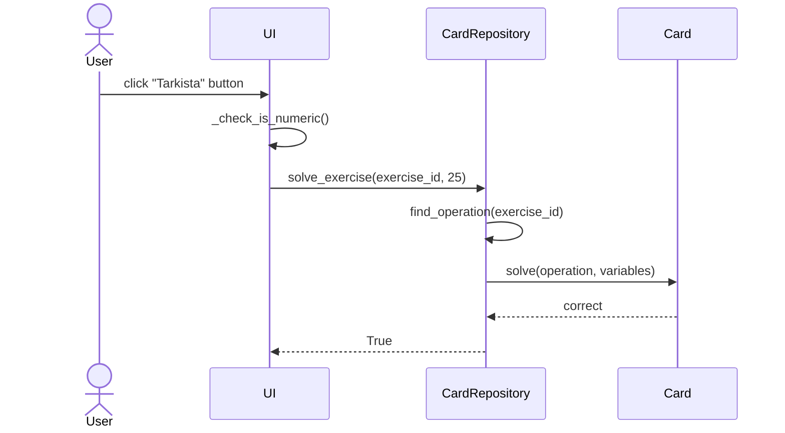
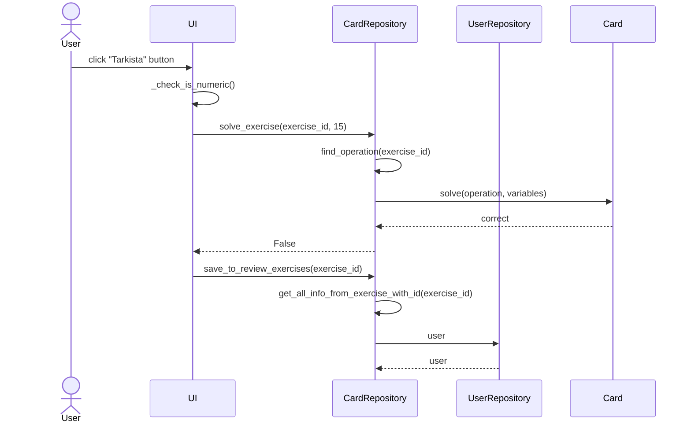

# Arkkitehtuurikuvaus

## Rakenne

Ohjelman rakenne on pääasiassa mukaelma kurssin referenssisovelluksen kerrosarkkitehtuurista. Ohjelman koodi on src hakemiston sisällä jaettu hakemistoihin repositories ja ui. 
Sovelluksessa on käytössä Tkinter kirjaston avulla toteutettu graafinen käyttöliittymä, johon liittyvä koodi löytyy ui hakemistosta. Ohjelman suorittaminen graafisessa käyttöliittymässä alkaa kutsumalla index.py tiedostoa, joka kutsuu ui-hakemistossa olevia funktioita. Tietokantaoperaatioista vastaa repositories-hakemistosta löytyvät luokat CardRepository ja UserRepository. Tehtäväkortin sisältämän tiedon käsittelyyn käytetään cards.py tiedoston Card-luokkaa.

## Käyttöliittymä

Käyttöliittymässä on seuraavat näkymät:

- Kirjautumisnäkymä
- Rekisteröitymisnäkymä
- Tehtäväaiheiden listanäkymä
- Tehtävänäkymä

Käyttöliittymässä nämä kaikki on toteutettu omiin luokkiinsa, joista jokainen sijaitsee omassa python tiedostossa ui-alihakemistossa. Sovelluksen UI-luokka vastaa graafisessa käyttöliittymässä eri näkymien näyttämisestä, piilottamisesta ja tuhoamisesta. Käyttöliittymä kutsuu muita luokkia eri funktioiden ja metodien toteuttamiseen.

## Sovelluslogiikka

Sovelluksen logiikka perustuu pääasiassa luokkaan Card sekä luokkiin CardRepository ja UserRepository. Luokka Card vastaa tehtäväkortin (card) toiminnoista kuten muuttujien arvojen generoinnista, oikean vastauksen generoinnista ja tehtävänannon tulostamisesta. CardRepository vastaa niistä tehtäviin liittyvistä toiminnoista, joissa tehdään tietokantaoperaatioita tai vuorovaikutetaan läheisesti tietokantaoperaatioiden kesken. 

Sovelluksen käyttäjää ja luokkaa Card voidaan havainnollistaa seuraavalla kaaviolla:

Eli siis käyttäjä vuorovaikuttaa sovelluksessa Card luokan kanssa, joka kuvastaa tehtäväkorttia. Jokaisella käyttäjällä on käyttäjätunnus ja salasana sekä users tietokantataulussa id (integer primary key). Jokaisella kortilla on tehtävän id, kategorian numero, muuttujat ja kysymys (tehtävänanto). 

Sovelluksen luokkien suhdetta voidaan havainnollistaa seuraavalla luokkakaaviolla:

Sovelluksessa on tehtäväkortteja, joita käyttäjällä voi olla useita, tehtävillä on sovelluksen suorituksenaikana yksi käyttäjä, joka ratkaisee tehtäviä ja saman kategorian tehtävät muodostavat kokonaisuuden. Eri kategorioiden thtävät muodostavat tehtäväpakan.
 
# Sovelluksen päätoiminnallissudet

### Käyttäjätunnuksen luominen

### Sisäänkirjautuminen

### Tehtävän valinta

### Tehtävään vastaaminen

Jos tehtävän vastaus on oikein:

Jos tehtävän vastaus on väärin:

