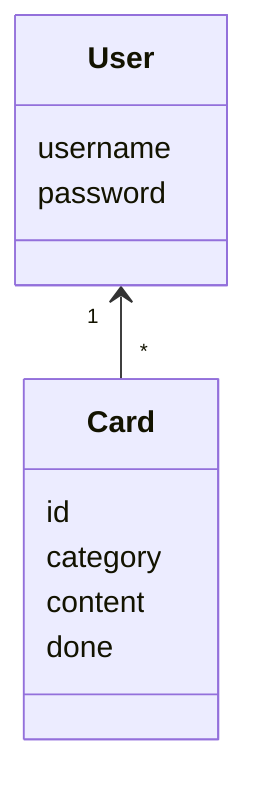
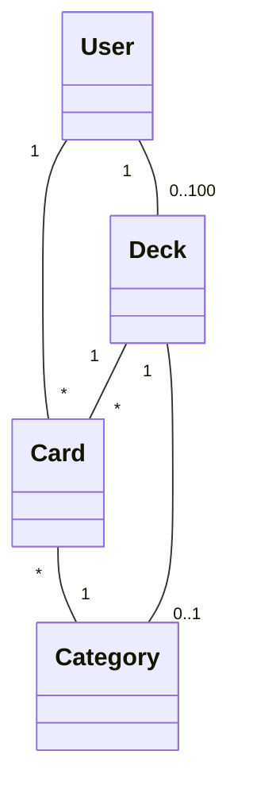

```mermaid
 classDiagram
    User "1" <-- "*" Card

    class User{
        username
        password
    }

    class Card{
        id
        category
        content
        done
    }
```

```mermaid
 classDiagram
    User "1" -- "*" Card
    User "1" -- "0..100" Deck
    Card "*" -- "1" Category
    Deck "1" -- "*" Card
    Deck "1" -- "0..1" Category 
```
 

