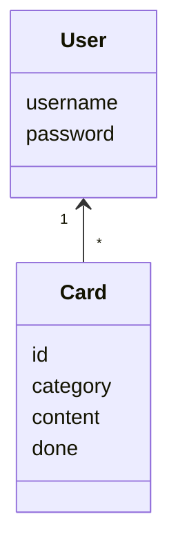
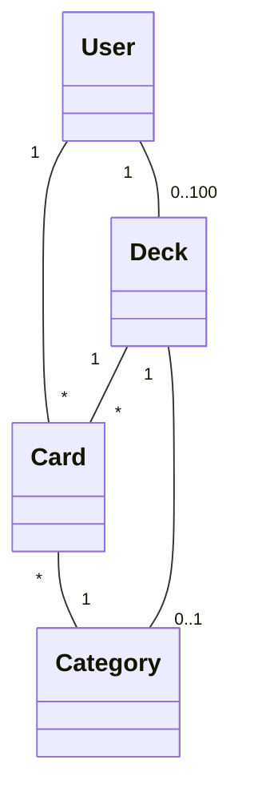
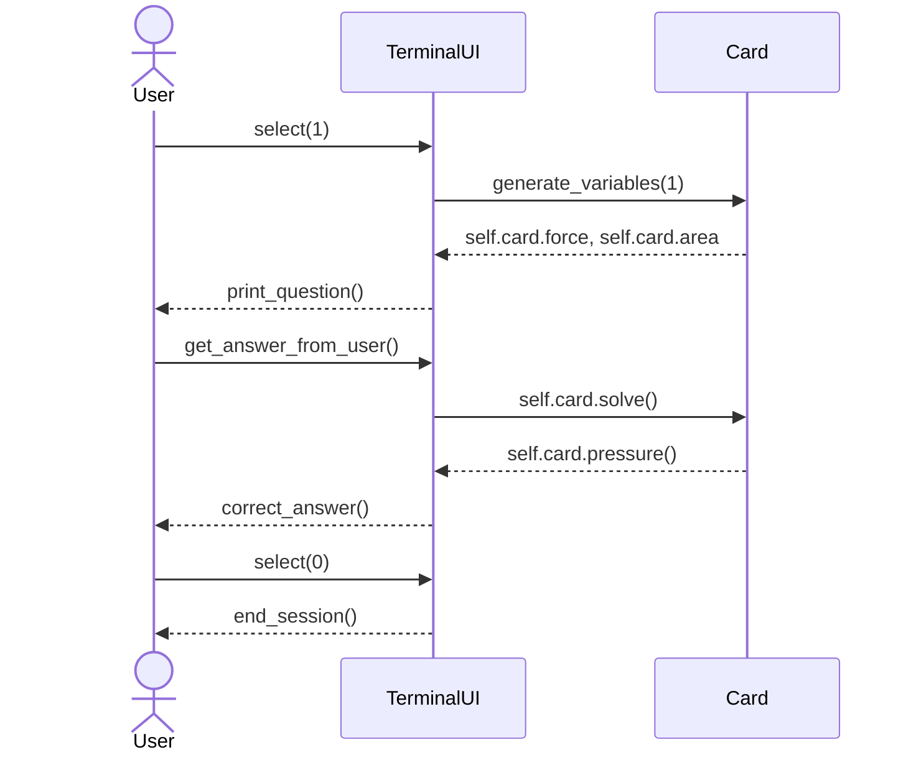

# Arkkitehtuurikuvaus

## Rakenne

Ohjelman rakenne on pääasiassa mukaelma kurssin referenssisovelluksen kerrosarkkitehtuurista. Ohjelman koodi on tällä hetkellä src hakemiston sisällä jaettu hakemistoihin repositories ja ui. 
Tällä hetkellä sovelluksessa on käytössä pitemmälle toteutettu tekstikäyttöliittymä, jonka koodi löytyy tiedostosta src/terminalui,py, sekä Tkinter kirjaston avulla toteutettu, vielä keskeneräinen, graafinen käyttöliittymä, johon liittyvä koodi löytyy ui hakemistosta. Ohjelman suorittaminen graafisessa käyttöliittymässä alkaa kutsumalla index.py tiedostoa, joka kutsuu ui-hakemistossa olevia funktioita. Tietokantaoperaatioista vastaa sekä graafisessa että tekstikäyttöliittymässä repositories-hakemistosta löytyvät luokat CardRepository ja UserRepository. Tehtäväkortin sisältämän tiedon käsittelyyn käytetään cards.py tiedoston Card-luokkaa.

## Käyttöliittymä

Käyttöliittymässä on seuraavat näkymät:

- Kirjautumis-/rekisteröitymisnäkymä
- Tehtäväaiheiden listanäkymä
- Tehtävänäkymä

Tekstipohjaisessa käyttöliittymässä nämä kaikki näkymät on toteutettu TerminalUI-luokassa,  mutta graafisessa käyttöliittymässä nämä kaikki on toteutettu omiin luokkiinsa. Sovelluksen UI-luokka vastaa graafisessa käyttöliittymässä eri näkymien näyttämisestä, piilottamisesta ja tuhoamisesta. Käyttöliittymä kutsuu muita luokkia eri funktioiden ja metodien toteuttamiseen.

## Sovelluslogiikka

Sovelluksen logiikka perustuu pääasiassa luokkaan Card sekä luokkaan User. Luokka Card vastaa tehtäväkortin (card) toiminnoista kuten muuttujien arvojen generoinnista ja tehtävänannon tulostamisesta. Luokka User kuvaa sovelluksen käyttäjää. Luokan User tietokantatoiminnoista vastaa UserRepository luokka. 

Sovelluksen luokkien suhdetta voidaan havainnollistaa seuraavalla luokkakaaviolla:

 
# Sovelluksen päätoiminnallissudet

### TerminalUI:n ja luokan Card toiminta sekvenssikaaviona

Tekstipohjaisen käyttöliittymän toimintaa voidaan havainnollistaa seuraavalla sekvenssikaaviolla:

