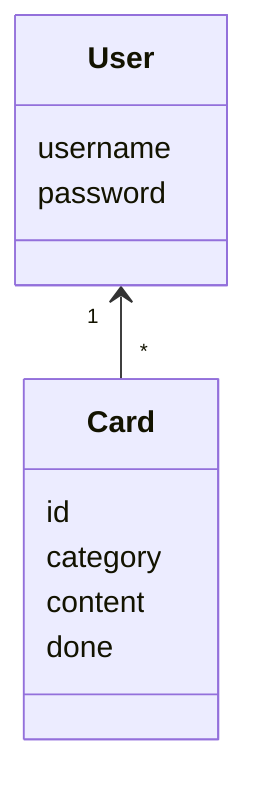
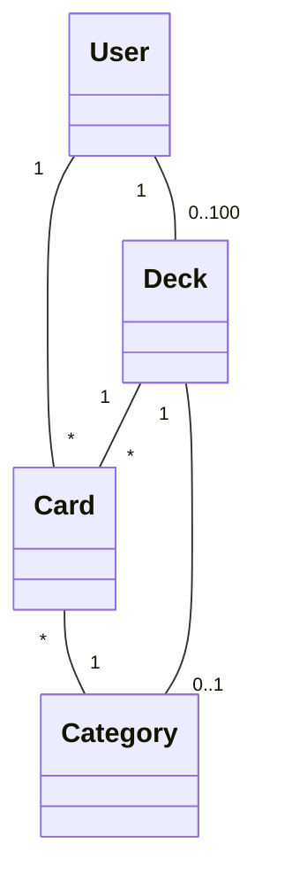
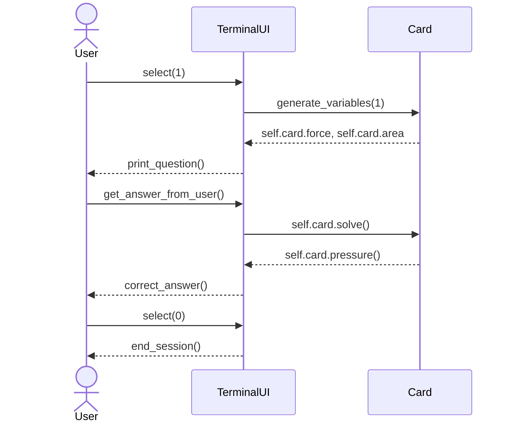

```mermaid
 classDiagram
    User "1" <-- "*" Card

    class User{
        username
        password
    }

    class Card{
        id
        category
        content
        done
    }
```

```mermaid
 classDiagram
    User "1" -- "*" Card
    User "1" -- "0..100" Deck
    Card "*" -- "1" Category
    Deck "1" -- "*" Card
    Deck "1" -- "0..1" Category 
```
 

## Terminaluin ja luokan Card toiminta sekvenssikaaviona

```mermaid
sequenceDiagram
  actor User
  participant TerminalUI
  participant Card
  User->>TerminalUI: select(1)
  TerminalUI->>Card: generate_variables(1)
  Card-->>TerminalUI: self.card.force, self.card.area
  TerminalUI-->>User: print_question()
  User->>TerminalUI: get_answer_from_user()
  TerminalUI->>Card: self.card.solve()
  Card -->> TerminalUI: self.card.pressure()
  TerminalUI -->> User: correct_answer()
  User ->> TerminalUI: select(0)
  TerminalUI -->> User: end_session()
```